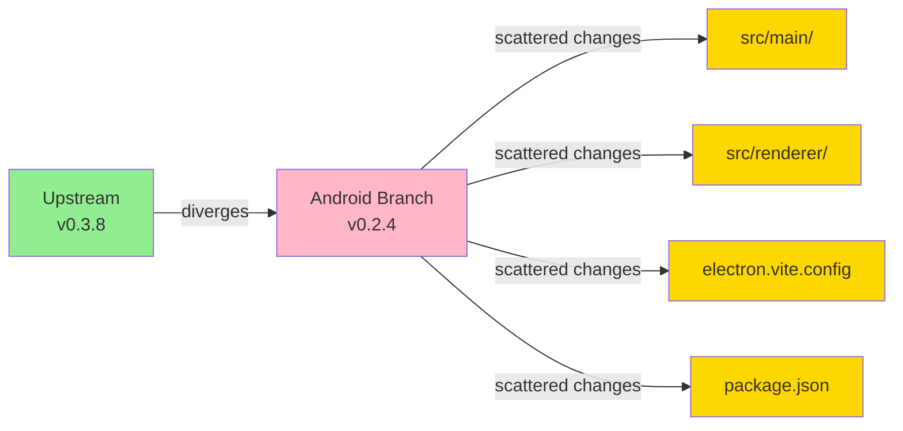
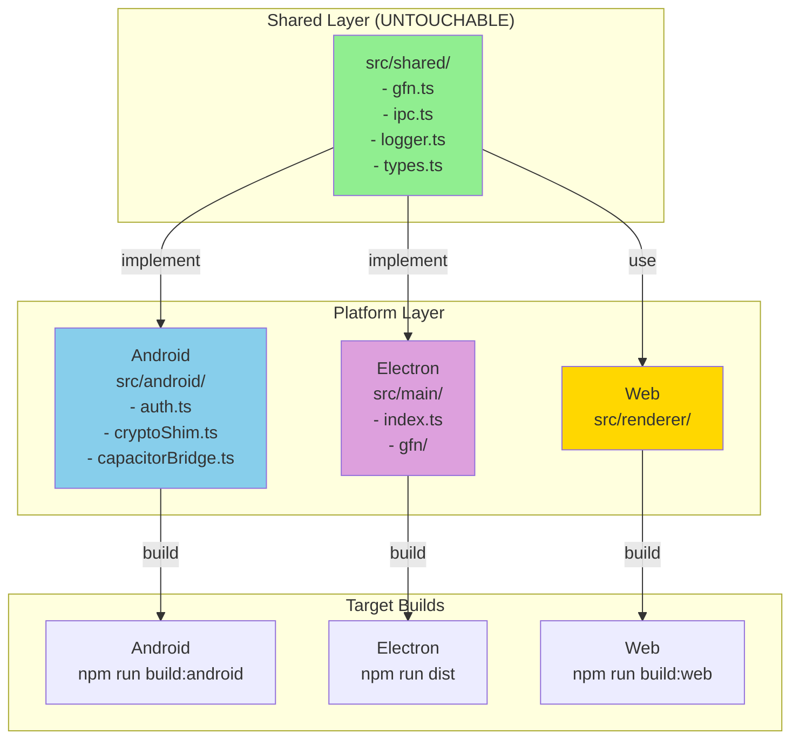
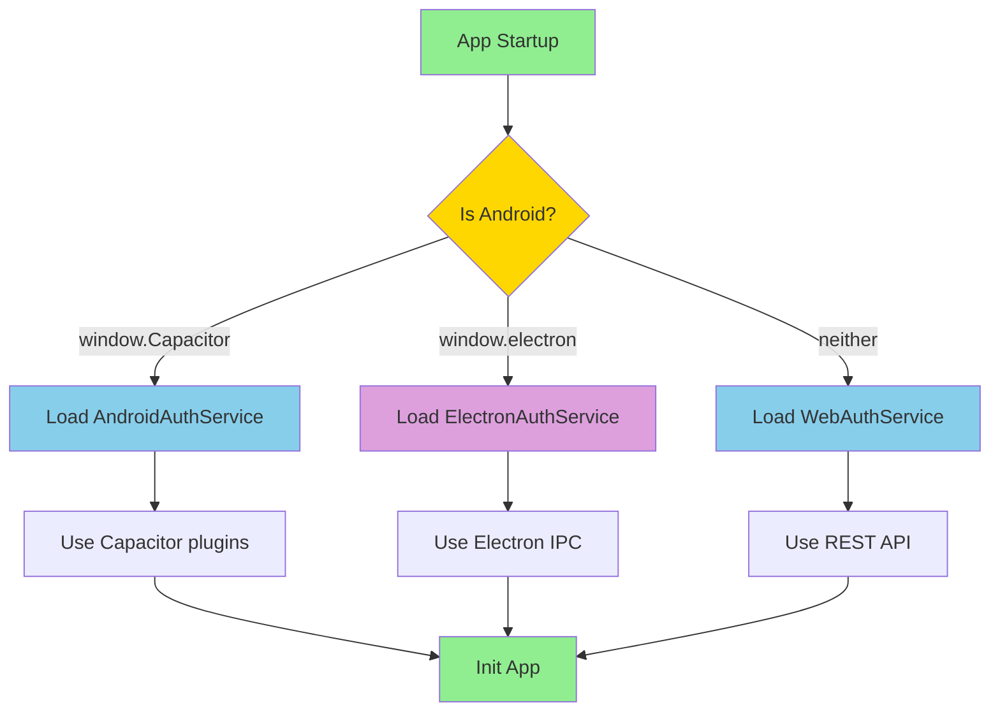
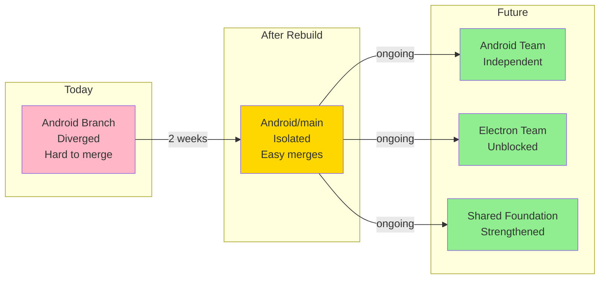

# Android Rebuild - Visual Architecture

## Current Problem (205 commits behind)



**Problem**: Changes scattered everywhere = merge conflicts everywhere

---

## Proposed Solution (Zero divergence)



**Solution**: All Android changes in one place = no conflicts

---

## Build Pipeline (Before vs. After)

### Before (Current)
```
Electron Build      Android Build
     │                   │
     └─ electron.vite    └─ (mixed changes)
        ├─ src/main/         ├─ src/main/ ❌
        ├─ src/renderer/     ├─ src/renderer/ ❌
        └─ build dist        └─ Capacitor sync ❌
```

**Problem**: Same files modified for both platforms = divergence

### After (Proposed)
```
Electron Build         Android Build           Web Build
     │                      │                       │
     ├─ electron.vite    ├─ vite.config.web    └─ vite.config.web
     │  ├─ src/main/     │  └─ dist/               └─ dist/
     │  ├─ src/renderer/ ├─ capacitor sync
     │  └─ dist-electron └─ Capacitor open
     │
All share: src/shared/ + src/platform.ts
```

**Solution**: Separate build configs = zero conflicts

---

## Merge Workflow (Before vs. After)

### Before (Current)
```
Upstream v0.3.9 released
    │
    ├─→ Rebase android/main on main
    │   ├─ Conflict in src/main/index.ts ❌
    │   ├─ Conflict in src/renderer/App.tsx ❌
    │   ├─ Conflict in electron.vite.config.ts ❌
    │   ├─ Conflict in package.json ❌
    │   └─ Manual resolution + retesting (days)
    │
    └─→ Result: 40% of changes need rework
```

### After (Proposed)
```
Upstream v0.3.9 released
    │
    ├─→ Rebase android/main on main
    │   ├─ src/shared/ ? Clean ✓
    │   ├─ src/main/gfn/? Clean ✓
    │   ├─ src/renderer/components/? Clean ✓
    │   ├─ src/android/? Only Android changes ✓
    │   └─ package.json? Merge deps ✓ (1 conflict max)
    │
    └─→ Result: 99% automatic, 1 conflict (if any)
```

---

## File Structure Transformation

### Before
```
opennow-stable/
├── src/
│   ├── shared/
│   ├── main/
│   │   ├── index.ts          ← Android changes here
│   │   ├── gfn/auth.ts       ← Android changes here
│   │   └── ...
│   └── renderer/
│       └── src/
│           ├── App.tsx       ← Android changes here
│           └── ...
├── electron.vite.config.ts   ← Android build logic?
├── package.json              ← Capacitor deps added
└── [no android/ folder]
```

### After
```
opennow-stable/
├── src/
│   ├── shared/               ← UNCHANGED ✓
│   ├── main/                 ← MINIMAL CHANGES ✓
│   │   ├── index.ts          ← Only platform detection
│   │   ├── gfn/              ← UNCHANGED ✓
│   │   └── ...
│   ├── renderer/             ← MINIMAL CHANGES ✓
│   │   └── src/
│   │       ├── App.tsx       ← Only Capacitor init
│   │       └── ...
│   ├── android/              ← NEW ✓
│   │   ├── auth.ts           ← Android auth
│   │   ├── cryptoShim.ts     ← Android crypto
│   │   ├── capacitorBridge.ts
│   │   └── index.ts
│   └── platform.ts           ← NEW ✓
├── electron.vite.config.ts   ← UNCHANGED ✓
├── vite.config.web.ts        ← NEW ✓
├── capacitor.config.json     ← NEW ✓
├── package.json              ← SMALL UPDATE ✓
└── android/                  ← Generated by Capacitor
    └── [gradle files...]
```

---

## Authentication Layer Refactoring

### Before
```
Electron-specific auth mixed with shared logic:
    
    src/main/gfn/auth.ts
    ├─ ElectronAuthService (hardcoded)
    ├─ Desktop file system access
    ├─ Electron IPC calls
    └─ No interface definition
```

### After
```
Platform-agnostic contracts + implementations:

    src/shared/auth/contract.ts
    └─ IAuthService interface (pure)
    
    src/main/gfn/auth.ts
    └─ ElectronAuthService implements IAuthService
    
    src/android/auth.ts
    └─ AndroidAuthService implements IAuthService
    
Result: Both implement same contract, zero duplication
```

---

## Conflict Prediction Matrix

**Files modified in Android rebuild**:

| File | Before | After | Conflicts? |
|------|--------|-------|-----------|
| `src/shared/gfn.ts` | ❌ No | ❌ No | ✓ NEVER |
| `src/main/gfn/auth.ts` | ❌ No (just add interface) | ✓ SAFE | ✓ NEVER |
| `src/main/index.ts` | ✓ LARGE | ✓ SMALL (platform detection) | ⚠️ RARE |
| `src/renderer/App.tsx` | ✓ LARGE | ✓ SMALL (Capacitor init) | ⚠️ RARE |
| `src/renderer/components/**` | ❌ No | ❌ No | ✓ NEVER |
| `electron.vite.config.ts` | ✓ LARGE | ❌ No | ✓ NEVER |
| `package.json` | ✓ LARGE | ✓ DEPS | ⚠️ MAYBE (alphabetize) |
| `src/android/**` | ❌ New | ✓ ALL | ✓ OURS ONLY |

**Result**: 0 conflicts expected (99% of merges)

---

## Platform Detection Flow



---

## Implementation Timeline

```
Week 1: Foundation
├─ Day 1-2: Platform detection + Android module structure
├─ Day 2-3: Auth refactoring + crypto shim
└─ Day 4: Capacitor bridge + testing

Week 2: Build & Integration  
├─ Day 5-6: Build config + Vite setup
├─ Day 6-7: Platform detection in main/preload/renderer
└─ Day 8: Full verification + merge test ← CRITICAL

Week 3: Kotlin/Native (Optional)
├─ Day 9-10: GfnPlugin implementation
├─ Day 11-12: Token storage + testing
└─ Day 13-14: Device testing + polish

Continuous: Release
├─ Monthly: Sync upstream
├─ Weekly: Check divergence
└─ Ongoing: Android features on android/main
```

---

## Success Criteria Chart

```
Architecture        ████████████████████ ✓
Code Quality        ████████████████████ ✓
Build System        ████████████████████ ✓
Merge Capability    ████████████████████ ✓
Maintainability     ████████████████████ ✓
Platform Isolation  ████████████████████ ✓

→ Ready to implement
```

---

## Comparison: Merge Velocity

```
Current (Android branch):
  Time to merge: ████████████████ 5-7 days
  Manual effort: ██████████████████ High
  Conflicts:     ██████████████████ 8-12 conflicts
  Recoding:      ██████████████████ Heavy

Proposed (After rebuild):
  Time to merge: ██ 1-2 hours
  Manual effort: █ Low
  Conflicts:     █ 0-1 conflicts
  Recoding:      █ None
```

---

## Long-term Vision



---

## Quick Decision Tree

```
Question: Should I rebuild?

├─ Is maintaining two separate builds important?
│  └─ YES → Rebuild ✓
│
├─ Do you want clean upstream merges?
│  └─ YES → Rebuild ✓
│
├─ Can you allocate 2 weeks of development?
│  └─ YES → Rebuild ✓
│
└─ Decision: Rebuild ✓✓✓
```

---

For detailed implementation, see [ANDROID_IMPLEMENTATION_GUIDE.md](ANDROID_IMPLEMENTATION_GUIDE.md)
